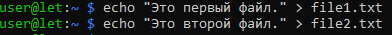
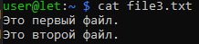
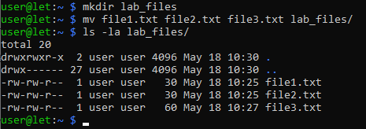
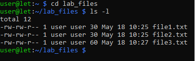
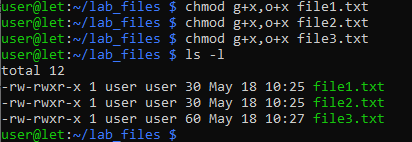

# Лабораторная работа №24

## ИЗУЧЕНИЕ ФАЙЛОВОЙ СИСТЕМЫ ОС LINUX И ФУНКЦИЙ ПО ОБРАБОТКЕ И УПРАВЛЕНИЮ ДАННЫМИ


## Цель работы

- Изучение команд, связанных с пользователями и группами
- Изучение структуры файловой системы Linux, изучение общих команд создания, удаления, модификации файлов и каталогов, функций манипулирования данными, алиасами
- Изучение иерархии процессов
- Приобретение навыков по смене атрибутов объектов, смене прав доступа к объектам
- Изучение организации безопасности системы, местонахождение файлов с паролями, просмотр системной информации и получение служебной информации

---

## Оборудование

**Аппаратная часть:** персональный компьютер, сетевой или локальный 

**Программная часть:** операционная система Linux Ubuntu

---

# Задание 2



# Задание 3



# Задание 4



# Задание 5



# Задание 6



# Задание 7


# Задание 8


# Вопросы

## 1. Что считается файлами в OC LINUX?

В Linux действует принцип «всё есть файл». Файлами считается не только привычная информация на диске, но и практически любой объект системы. Выделяют следующие типы файлов:

- **Обычные файлы (`-`):** Содержат данные (текст, код программ, изображения, бинарные данные).
- **Каталоги (`d`):** Файлы, содержащие списки других файлов и связи между ними.
- **Символьные ссылки (`l`):** Файлы-указатели на другие файлы.
- **Файлы устройств:**
  - **Блочные (`b`):** Устройства, работающие с данными блоками (жесткие диски, SSD).
  - **Символьные (`c`):** Устройства, работающие с потоками символов (клавиатура, мышь, терминал).
- **Именованные каналы (`p`):** Файлы для межпроцессного взаимодействия (FIFO).
- **Сокеты (`s`):** Файлы для сетевого взаимодействия между процессами.

Процессы, системные настройки и информация о железе часто представлены в виде файлов в директориях вроде `/proc` и `/sys`.

## 2. Объясните назначение связей с файлами и способы их создания.

Связи (links) позволяют обращаться к одним и тем же данным под разными именами или из разных мест файловой системы.

**Жёсткие связи (Hard Links):**
- **Назначение:** Создание дополнительного имени для существующего файла (общего inode). Все жёсткие связи равноправны. Данные удаляются только при удалении последней жёсткой связи.
- **Создание:** `ln файл_источник файл_связь`
- **Ограничения:** Нельзя создавать для каталогов и между разными файловыми системами.

**Символьные (символические) связи (Symbolic Links):**
- **Назначение:** Создание указателя (ярлыка) на файл или каталог. Это отдельный файл, хранящий путь к цели.
- **Создание:** `ln -s /путь/к/цели файл_связь`
- **Преимущества:** Можно ссылаться на каталоги и объекты на других разделах. Работают даже с несуществующими целями («битые» ссылки).

## 3. Что определяет атрибуты файлов и каким образом их можно просмотреть и изменить?

Атрибуты определяют права доступа, владельца, временные метки и специальные флаги файла.

- **Права доступа и владелец:**
  - **Просмотр:** `ls -l`
  - **Изменение прав:** `chmod` (например, `chmod 755 файл` или `chmod u+x файл`)
  - **Изменение владельца:** `chown` (например, `chown user:group файл`)

- **Временные метки:**
  - **Просмотр:** `stat файл`
  - **Изменение:** `touch` (время модификации и доступа, например, `touch -a -m -t 202405011200 файл`)

- **Расширенные атрибуты файловой системы:**
  - **Просмотр:** `lsattr`
  - **Изменение:** `chattr` (например, `chattr +i файл` для защиты от удаления)

## 4. Какие методы создания и удаления файлов, каталогов Вы знаете?

**Создание файлов:**
- `touch имя_файла` — создание пустого файла или обновление временных меток.
- `cat > файл` — создание файла с записью ввода до Ctrl+D.
- `echo "текст" > файл` — создание файла с содержимым (или перезапись).
- Редакторы: `vim`, `nano`.
- Перенаправление вывода любой команды: `ls -la > список.txt`.

**Создание каталогов:**
- `mkdir имя_каталога` — создание пустого каталога.
- `mkdir -p /путь/к/каталогу` — создание цепочки вложенных каталогов.

**Удаление файлов и каталогов:**
- `rm файл` — удаление файла.
- `rm -f файл` — принудительное удаление без запросов.
- `rmdir пустой_каталог` — удаление только пустого каталога.
- `rm -r каталог` — рекурсивное удаление каталога с содержимым (опасно).
- `rm -rf каталог` — принудительное рекурсивное удаление (особо опасно).

## 5. В чем заключается поиск по шаблону?

Поиск по шаблону — это отбор файлов или строк, соответствующих заданной маске, а не точному имени.

- **Для имен файлов (shell):** Используются подстановочные символы (wildcards):
  - `*` — любое количество любых символов.
  - `?` — ровно один любой символ.
  - `[abc]` — один символ из набора.
  - Пример: `ls *.txt`, `find / -name "file-?.log"`

- **Для содержимого файлов (регулярные выражения):** Используется мощный язык шаблонов для поиска текста, реализованный в командах (`grep`, `sed`, `awk`) и языках программирования.
  - `.` — любой один символ.
  - `^` — начало строки.
  - `$` — конец строки.
  - `*` — повторение 0 или более раз.
  - Пример: `grep "^error" log.txt`


## 6. Какой командой можно получить список работающих пользователей и сохранить его в файле?


### Команды для просмотра работающих пользователей

**`users`** — выводит имена пользователей, имеющих активные сессии, в одну строку через пробел:
```bash
users
# Пример вывода: root ivan petr petr
```

**`who`** — показывает подробную информацию о каждой сессии:
```bash
who
# Пример вывода:
# ivan    tty1         2025-05-18 10:15
# petr    pts/0        2025-05-18 10:20 (192.168.1.10)
# petr    pts/1        2025-05-18 10:25 (192.168.1.10)
```

**`w`** — расширенная информация о пользователях и нагрузке системы:
```bash
w
```

### Сохранение списка уникальных пользователей в файл

**Способ 1 (через `users`):**
```bash
users | tr ' ' '\n' | sort -u > пользователи.txt
```

**Способ 2 (через `who` и `awk`):**
```bash
who | awk '{print $1}' | sort -u > пользователи.txt
```

**Способ 3 (через `who` и `cut`):**
```bash
who | cut -d' ' -f1 | sort -u > пользователи.txt
```

### Пояснение конвейера

| Команда | Назначение |
|---------|------------|
| `users` или `who` | Получение списка активных пользователей |
| `tr ' ' '\n'` | Замена пробелов на перевод строки (только для `users`) |
| `awk '{print $1}'` | Извлечение первого поля — имени пользователя |
| `cut -d' ' -f1` | Извлечение первого поля через разделитель-пробел |
| `sort -u` | Сортировка и удаление дубликатов |
| `> пользователи.txt` | Запись результата в файл (перезапись) |
| `>> пользователи.txt` | Добавление в конец файла без перезаписи |

### Проверка результата
```bash
cat пользователи.txt
# Пример содержимого:
# ivan
# petr
# root
