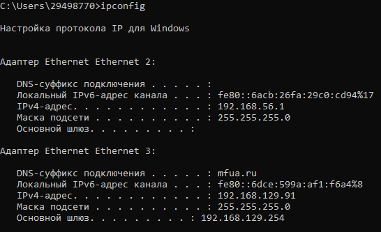
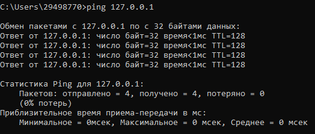
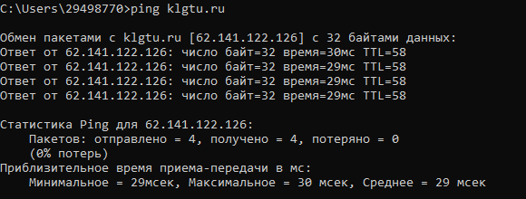
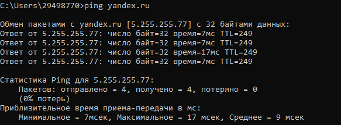
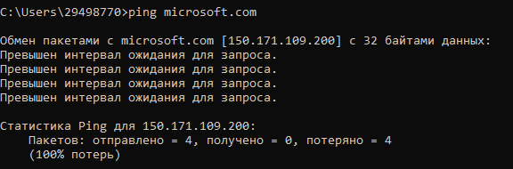
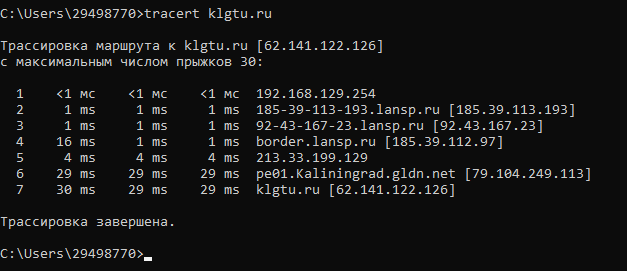
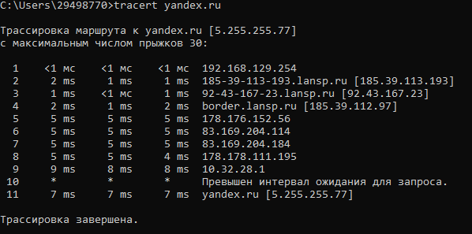
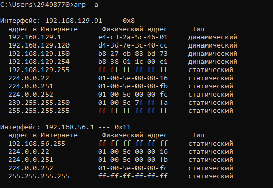

# Лабораторная работа №2 <<Изучение программных средств тестирования и определения параметров настройки в компьютерных сетях>>

## Цель работы:
 приобретение знаний и практических навыков в
использовании программного обеспечения для настройки и
тестирования компьютерной сети.

## Материалы, оборудование, программное обеспечение:
 лаборатория,
оснащенная персональными компьютерами, объединенными в локальную
сеть с доступом в Интернет, утилиты сканирования беспроводных сетей.

# Задание 1

# Задание 2

# Задание 3

# Задание 4

# Задание 5

# Задание 6

# Задание 7

# задание 8

